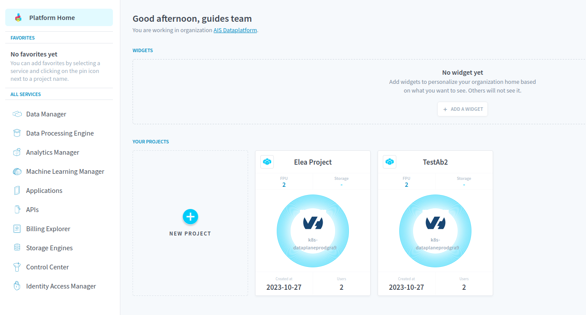
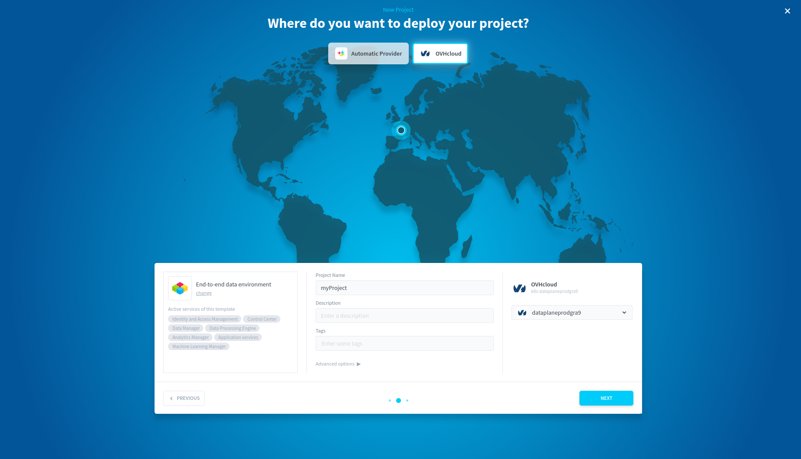

## Get started with your cloud AI application

The Getting Started guide will teach you **how to create an AI project using the Data Platform**, through concrete examples and **best practices**. At the end of this tutorial, you will be completely self-sufficient. You’ll be able to create and deploy your own customized AI application with sophisticated data processing and machine learning predictions.

The guide uses sample data, and demonstrates how to build an AI application with predictive insights correlating subway traffic in the city of Chicago with weather variables and the time of the year.

This Getting Started guide is organized into two tutorials. The first tutorial will show you how to build your first application using the Data Platform. In the second tutorial, you will learn how to set-up and train a machine learning model using historical data, in order to add smart recommendations to your AI application.

## Setting-up your environment

Before you start working with data, you will need to set-up a working project environment. Your working environment is called a Project. It includes all the necessary tools and dedicated compute and storage resources you’ll need to build your AI application.

### Create a Project

If this is your first project:

Otherwise:

Creating a new Project only takes a few minutes! It is possible to choose the cloud provider and region for your data (cloud or on-premise) as well as which Project template you want to start with.

Data Platform was engineered to easily scale Projects as they grow. At any time after your Project is created, you will be able to expand its capabilities and storage volume throughout the Project thanks to horizontal and vertical scalability.

Creating a Project is done in 3 steps:

- Choose a template
- Choose a cloud provider and region for your Project
- Overview and confirmation

#### Choose a template

Start by picking the template that suits your use case the most. If no template fits your needs perfectly, don't worry! You can add services to the Project later. To make sure all your needs are covered we suggest that you **pick the End-to-end template**.

#### Choose a cloud provider and region for your Project

This is the location of the data center where:

*   your Project's configuration will be stored
*   your object store will be stored
*   your data processing jobs, querying, APIs and applications will be running

> [!primary]
>
> Your Project's databases are stored in the storage engine(s) your Project is linked to. The storage engine can be in a different cloud provider or region, in which case the data will transit over the public internet when accessed by your Project.
>

Start by choosing a cloud provider.

Choose a location either by clicking on the desired spot on the map, or by manually selecting your region in the dropdown menu.

Once you are happy with your cloud choice, enter the name of your Project. **This name cannot be modified later on** and will by default correspond to the Domain Name System (DNS) of your Project.

You can also **customise domain and subdomain** in the advanced options of this step.

#### Overview and confirmation

Finally, you'll get to this ultimate screen summing up all the information related to your Project.

By clicking on `Create the project`{.action}, the creation of your Project will start.

A collection of cloud micro-services are automatically set up in just a few minutes: web-app firewalls, security groups, CDNs, DNS configuration, SSL/TLS certificates, API endpoints, capacity planning, load balancer, auto-scaling, Kubernetes, cache, ETL, data warehouse engine, and more…

You will receive an email once the creation is finished, meaning the Project is ready to be used.

## Tutorials

- [**Tutorial no.1 :** Create your first analytics app from scratch 📊](/pages/public_cloud/data_platform/tutorials/tuto_01_build_a_first_app_from_scratch/tuto_01_build_a_first_app_from_scratch_intro)

- [**Tutorial no.2 :** Create your first AI model from scratch 🤖](pages/public_cloud/data_platform/tutorials/tuto_02_build_an_ai_model_from_scratch/tuto_02_build_an_ai_model_from_scratch_intro)